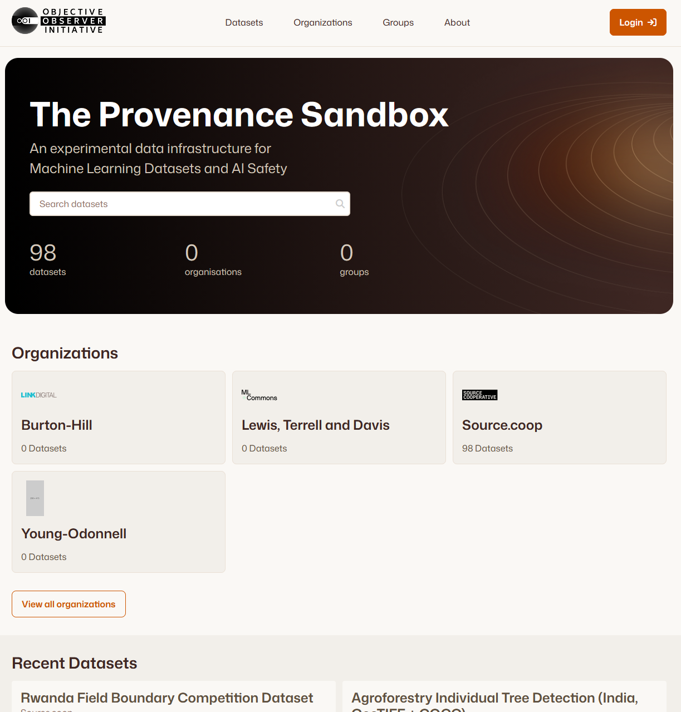
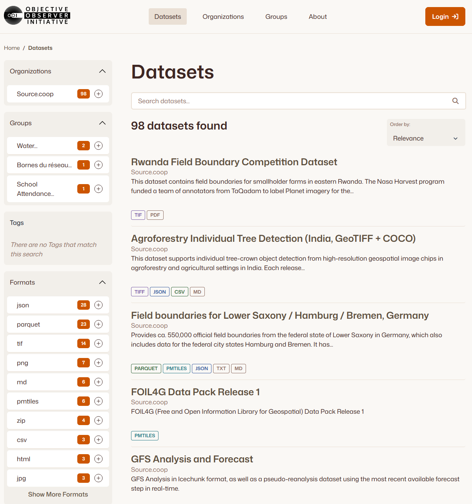
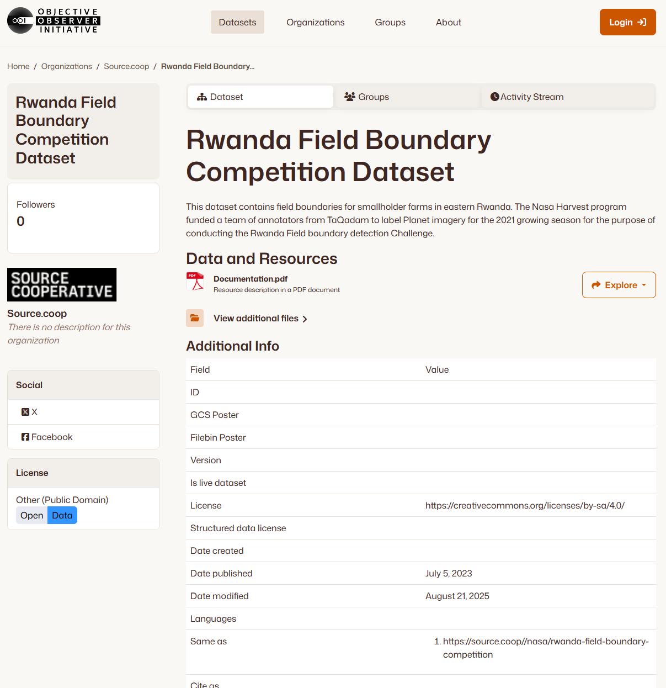

[](https://github.com/DataShades/ckanext-mlc-theme/actions/workflows/test.yml)

MLCommons CKAN theme
---

This CKAN theme is designed to be used with the [ckanext-theming](https://github.com/DataShades/ckanext-theming) extension.

It provides a consistent and visually appealing look and feel for the CKAN portal. Designed for the [MLCommons](https://mlcommons.org/) project.

## Compatibility

| CKAN version | Compatible? |
|---|---|
| 2.11 and earlier | no |
| 2.12 | yes |

> [!NOTE]
> This extension requires [ckanext-theming](https://github.com/DataShades/ckanext-theming) to run.

---

## Screenshots

Below are placeholders for screenshots of the MLC theme in action:

### Homepage


### Dataset Search / Registry page


### Dataset Detail page


---

## Installation

### 1. Install the Extension
Activate your CKAN virtual environment and install `ckanext-mlc-theme` and `ckanext-theming`:

```sh
pip install ckanext-theming
# Install ckanext-mlc-theme from source or pip
pip install -e .
```

Or for development/source installation:

```sh
git clone https://github.com/DataShades/ckanext-mlc-theme.git
cd ckanext-mlc-theme
pip install -e .
```

### 2. Enable Plugins
Add both `theming` and `mlc_theme` to the `ckan.plugins` list in your `ckan.ini` file:

```ini
ckan.plugins = ... theming mlc_theme
```

> [!TIP]
> Consider pinning `ckanext-theming` to a specific version (e.g. `ckanext-theming==X.Y.Z`) in your project's main requirements.

---

## Development

If you'd like to run the test suite, run:

```sh
pytest
```

---

## License

[AGPL-3.0](https://www.gnu.org/licenses/agpl-3.0.en.html)
